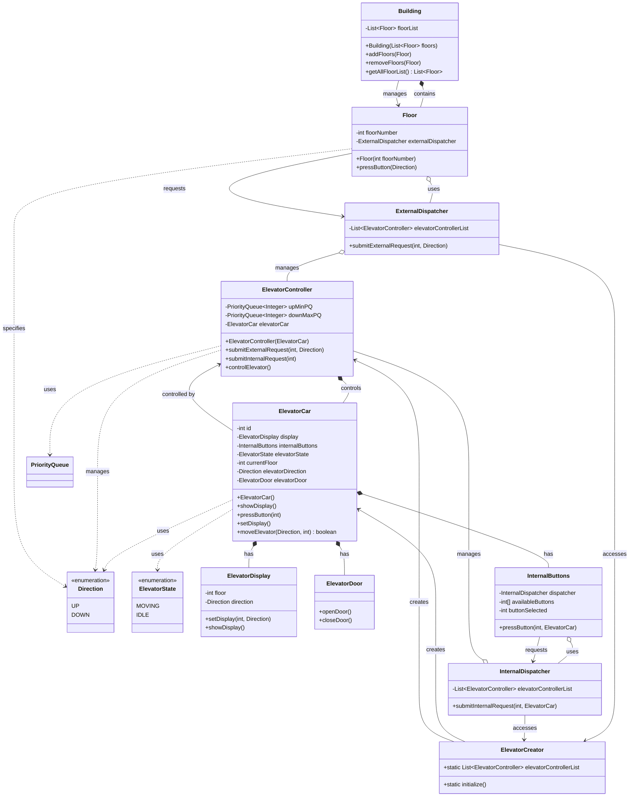

# CAC Elevator System - UML Class Diagram

## Key Relationships Explained:

### 1. **Composition (has-a) Relationships:**
- `Building` has `Floor` objects - Building owns all floors
- `ElevatorCar` has `ElevatorDisplay` - Car owns its display
- `ElevatorCar` has `InternalButtons` - Car owns its internal buttons
- `ElevatorCar` has `ElevatorDoor` - Car owns its door
- `ElevatorController` controls `ElevatorCar` - Controller owns the car it controls

### 2. **Aggregation (uses) Relationships:**
- `Floor` uses `ExternalDispatcher` - Floor uses dispatcher but doesn't own it
- `InternalButtons` uses `InternalDispatcher` - Buttons use dispatcher
- `ExternalDispatcher` manages `ElevatorController` objects - Dispatcher manages controllers
- `InternalDispatcher` manages `ElevatorController` objects - Dispatcher manages controllers

### 3. **Association (uses) Relationships:**
- `Building` manages `Floor` objects - Building handles floor operations
- `Floor` requests `ExternalDispatcher` - Floor submits external requests
- `InternalButtons` requests `InternalDispatcher` - Buttons submit internal requests
- `ElevatorCar` is controlled by `ElevatorController` - Car responds to controller

### 4. **Factory/Creation Relationships:**
- `ElevatorCreator` creates `ElevatorCar` objects - Factory creates cars
- `ElevatorCreator` creates `ElevatorController` objects - Factory creates controllers
- `ExternalDispatcher` accesses `ElevatorCreator` - Dispatcher uses factory's list
- `InternalDispatcher` accesses `ElevatorCreator` - Dispatcher uses factory's list

### 5. **Dependency (uses) Relationships:**
- `ElevatorCar` uses `Direction` - Car tracks its direction
- `ElevatorCar` uses `ElevatorState` - Car tracks its state
- `ElevatorController` manages `Direction` - Controller manages direction
- `ElevatorController` uses `PriorityQueue` - Controller uses queues for requests
- `Floor` specifies `Direction` - Floor specifies button direction

## System Architecture:

### **Core Components:**

1. **Building**: Main container that holds all floors
2. **Floor**: Represents a building floor with external button functionality
3. **ElevatorCar**: Represents an elevator with all its components
4. **ElevatorController**: Controls individual elevator movement and state
5. **ExternalDispatcher**: Handles external button requests from floors
6. **InternalDispatcher**: Handles internal button requests from elevator
7. **ElevatorCreator**: Factory class that creates elevators and controllers

### **Design Patterns Used:**

1. **Factory Pattern**: ElevatorCreator creates elevators and controllers
2. **Dispatcher Pattern**: External and Internal dispatchers handle requests
3. **Composition Pattern**: ElevatorCar composes all elevator components
4. **Priority Queue Pattern**: ElevatorController uses priority queues for requests
5. **Singleton-like Pattern**: ElevatorCreator maintains static list of controllers

### **System Flow:**

1. **External Request**: User presses button on a floor
2. **Floor Request**: Floor submits request to ExternalDispatcher
3. **Dispatcher Logic**: ExternalDispatcher routes request to appropriate elevator
4. **Controller Processing**: ElevatorController processes the request
5. **Internal Request**: User presses internal button in elevator
6. **Internal Processing**: InternalButtons submit request to InternalDispatcher
7. **Movement Control**: ElevatorController controls elevator movement

### **Key Features:**

- **Multiple Elevators**: System supports multiple elevators
- **Even-Odd Routing**: ExternalDispatcher uses even-odd logic for routing
- **Priority Queues**: Controllers use priority queues for efficient request handling
- **Component Separation**: Clear separation between external and internal requests
- **Factory Pattern**: Centralized creation of elevators and controllers

### **Architecture Differences from Own Implementation:**

1. **Dispatcher Pattern**: Uses separate dispatchers for external and internal requests
2. **Factory Pattern**: ElevatorCreator centralizes object creation
3. **Priority Queues**: More sophisticated request handling with priority queues
4. **Even-Odd Routing**: Simple routing strategy based on elevator and floor numbers
5. **Component-based**: ElevatorCar is composed of multiple components

This UML diagram shows a well-structured CAC elevator system with clear separation of concerns, proper use of design patterns, and scalable architecture for managing multiple elevators with sophisticated request handling. 