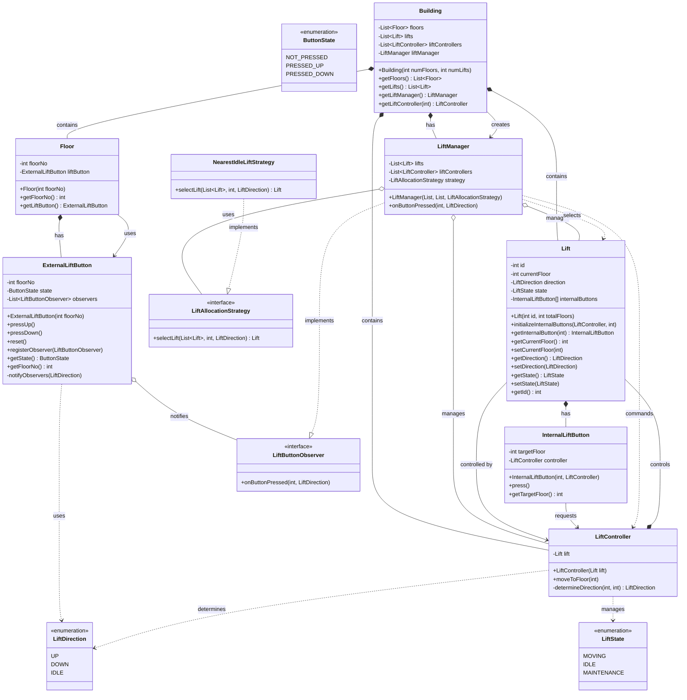

# Elevator System - UML Class Diagram

## Key Relationships Explained:

### 1. **Composition (has-a) Relationships:**
- `Building` has `Floor` objects - Building owns all floors
- `Building` has `Lift` objects - Building owns all lifts
- `Building` has `LiftController` objects - Building owns all controllers
- `Building` has `LiftManager` - Building owns the manager
- `Floor` has `ExternalLiftButton` - Each floor has its button
- `Lift` has `InternalLiftButton` objects - Each lift has internal buttons
- `LiftController` controls `Lift` - Controller owns the lift it controls

### 2. **Aggregation (uses) Relationships:**
- `LiftManager` manages `Lift` objects - Manager uses lifts but doesn't own them
- `LiftManager` manages `LiftController` objects - Manager uses controllers
- `LiftManager` uses `LiftAllocationStrategy` - Manager uses strategy for allocation
- `ExternalLiftButton` notifies `LiftButtonObserver` - Button notifies observers

### 3. **Implementation (implements) Relationships:**
- `LiftManager` implements `LiftButtonObserver` - Manager observes button presses
- `NearestIdleLiftStrategy` implements `LiftAllocationStrategy` - Strategy for lift selection

### 4. **Association (uses) Relationships:**
- `Building` creates `LiftManager` - Building sets up the manager
- `Floor` uses `ExternalLiftButton` - Floor interacts with its button
- `Lift` is controlled by `LiftController` - Lift responds to controller commands
- `InternalLiftButton` requests `LiftController` - Internal button commands controller

### 5. **Dependency (uses) Relationships:**
- `LiftManager` selects `Lift` - Manager chooses which lift to use
- `LiftManager` commands `LiftController` - Manager tells controller what to do
- `ExternalLiftButton` uses `LiftDirection` - Button specifies direction
- `LiftController` determines `LiftDirection` - Controller calculates direction
- `LiftController` manages `LiftState` - Controller manages lift state

## System Architecture:

### **Core Components:**

1. **Building**: Main container that holds all floors, lifts, and managers
2. **Floor**: Represents a building floor with external lift button
3. **Lift**: Represents an elevator with internal buttons and state
4. **LiftController**: Controls individual lift movement and state
5. **LiftManager**: Manages all lifts and handles external button requests
6. **ExternalLiftButton**: Floor-level buttons for calling lifts
7. **InternalLiftButton**: Lift interior buttons for destination selection

### **Design Patterns Used:**

1. **Observer Pattern**: ExternalLiftButton notifies LiftButtonObserver (LiftManager)
2. **Strategy Pattern**: Different lift allocation strategies (NearestIdleLiftStrategy)
3. **Composition Pattern**: Building composes all system components
4. **Command Pattern**: LiftController commands Lift operations
5. **State Pattern**: Lift has different states (IDLE, MOVING, MAINTENANCE)

### **System Flow:**

1. **External Request**: User presses external button on a floor
2. **Observer Notification**: ExternalLiftButton notifies LiftManager
3. **Strategy Selection**: LiftManager uses strategy to select appropriate lift
4. **Controller Command**: LiftManager commands selected lift's controller
5. **Lift Movement**: LiftController moves lift to requested floor
6. **Internal Request**: User presses internal button for destination
7. **Direct Control**: InternalLiftButton directly commands LiftController

### **Key Features:**

- **Multiple Lifts**: System supports multiple elevators
- **Smart Allocation**: Uses strategy pattern for lift selection
- **State Management**: Tracks lift states and directions
- **Observer Pattern**: Decouples button presses from lift management
- **Extensible**: Easy to add new allocation strategies

This UML diagram shows a well-structured elevator system with clear separation of concerns, proper use of design patterns, and scalable architecture for managing multiple lifts efficiently. 