# Parking Lot System - UML Class Diagram

```mermaid
classDiagram
    %% Enums
    class VehicleType {
        <<enumeration>>
        TWO_WHEELER
        FOUR_WHEELER
    }

    %% Core Classes
    class Vehicle {
        -String licensePlate
        -VehicleType vehicleType
        +Vehicle(String, VehicleType)
        +getLicensePlate() String
        +getType() VehicleType
    }

    class Ticket {
        -int ticketId
        -Vehicle vehicle
        -LocalDateTime entryTime
        -LocalDateTime exitTime
        -ParkingSpot parkingSpot
        +Ticket(int, Vehicle, LocalDateTime, ParkingSpot)
        +getTicketId() int
        +getVehicle() Vehicle
        +getEntryTime() LocalDateTime
        +getExitTime() LocalDateTime
        +setExitTime(LocalDateTime)
        +getParkingSpot() ParkingSpot
    }

    %% Parking Spot Hierarchy
    class ParkingSpot {
        <<abstract>>
        #int spotId
        #boolean isEmpty
        #Vehicle vehicle
        +ParkingSpot(int)
        +parkVehicle(Vehicle) boolean
        +unParkVehicle() Vehicle
        +isOccupied() boolean
        +getParkedVehicle() Vehicle
        +getSpotId() int
        +getPrice() int*
        +getSpotType() VehicleType*
        #canParkVehicle(Vehicle) boolean*
    }

    class TwoWheelerParkingSpot {
        -static final int PRICE
        +TwoWheelerParkingSpot(int)
        +getPrice() int
        +getSpotType() VehicleType
        #canParkVehicle(Vehicle) boolean
    }

    class FourWheelerParkingSpot {
        -static final int PRICE
        +FourWheelerParkingSpot(int)
        +getPrice() int
        +getSpotType() VehicleType
        #canParkVehicle(Vehicle) boolean
    }

    %% Parking Manager Hierarchy
    class ParkingManager {
        <<abstract>>
        #List~ParkingSpot~ parkingSpots
        #ParkingStrategy parkingStrategy
        +ParkingManager(ParkingStrategy)
        +ParkingManager(List, ParkingStrategy)
        +parkVehicle(Vehicle) boolean
        +unParkVehicle(String) Vehicle
        +findSpotByVehicle(String) Optional~ParkingSpot~
        +getOccupiedSpots() List~ParkingSpot~
        +getAvailableSpots() List~ParkingSpot~
        +addParkingSpot(ParkingSpot) boolean
        +removeParkingSpot(int) boolean
        +clearParkingLot()
    }

    class TwoWheelerParkingManager {
        +TwoWheelerParkingManager(ParkingStrategy)
    }

    class FourWheelerParkingManager {
        +FourWheelerParkingManager(ParkingStrategy)
    }

    %% Factory Classes
    class ParkingManagerFactory {
        -static TwoWheelerParkingManager twoWheelerManager
        -static FourWheelerParkingManager fourWheelerManager
        +getParkingManager(VehicleType) ParkingManager
        -getTwoWheelerManager() TwoWheelerParkingManager
        -getFourWheelerManager() FourWheelerParkingManager
    }

    class CostComputationStrategyFactory {
        +getStrategy(VehicleType) CostComputationStrategy
    }

    %% Strategy Interfaces and Implementations
    class ParkingStrategy {
        <<interface>>
        +findAvailableSpot(List~ParkingSpot~) Optional~ParkingSpot~
    }

    class NearEntranceParking {
        +findAvailableSpot(List~ParkingSpot~) Optional~ParkingSpot~
    }

    class NearExitParking {
        +findAvailableSpot(List~ParkingSpot~) Optional~ParkingSpot~
    }

    class PaymentStrategy {
        <<interface>>
        +pay(double) boolean
    }

    class CashPayment {
        +pay(double) boolean
    }

    class UpiPayment {
        -String upiId
        +UpiPayment(String)
        +pay(double) boolean
    }

    class CostComputationStrategy {
        <<interface>>
        +computeCost(Ticket) double
    }

    class TwoWheelerCostComputation {
        +computeCost(Ticket) double
    }

    class FourWheelerCostComputation {
        +computeCost(Ticket) double
    }

    %% Gate Classes
    class EntranceGate {
        -static AtomicInteger ticketCounter
        +bookSpot(Vehicle) Ticket
        -generateTicket(Vehicle, ParkingSpot) Ticket
    }

    class ExitGate {
        +ExitGate()
        +computeParkingPrice(Ticket) double
        +unPark(Ticket, PaymentStrategy) boolean
    }

    %% Relationships

    %% Inheritance Relationships
    TwoWheelerParkingManager --|> ParkingManager
    FourWheelerParkingManager --|> ParkingManager
    TwoWheelerParkingSpot --|> ParkingSpot
    FourWheelerParkingSpot --|> ParkingSpot

    %% Implementation Relationships
    NearEntranceParking ..|> ParkingStrategy
    NearExitParking ..|> ParkingStrategy
    CashPayment ..|> PaymentStrategy
    UpiPayment ..|> PaymentStrategy
    TwoWheelerCostComputation ..|> CostComputationStrategy
    FourWheelerCostComputation ..|> CostComputationStrategy

    %% Composition Relationships (strong ownership)
    ParkingManager *-- ParkingSpot : manages
    Ticket *-- Vehicle : contains
    Ticket *-- ParkingSpot : references
    Vehicle *-- VehicleType : has

    %% Aggregation Relationships (weak ownership)
    ParkingManager o-- ParkingStrategy : uses
    EntranceGate o-- ParkingManager : uses
    ExitGate o-- CostComputationStrategy : uses
    ExitGate o-- PaymentStrategy : uses

    %% Association Relationships
    ParkingManagerFactory --> ParkingManager : creates
    CostComputationStrategyFactory --> CostComputationStrategy : creates
    EntranceGate --> Ticket : generates
    ExitGate --> Ticket : processes

    %% Dependency Relationships
    ParkingManagerFactory ..> TwoWheelerParkingManager : creates
    ParkingManagerFactory ..> FourWheelerParkingManager : creates
    CostComputationStrategyFactory ..> TwoWheelerCostComputation : creates
    CostComputationStrategyFactory ..> FourWheelerCostComputation : creates
```

## Key Relationships Explained:

### 1. **Inheritance (is-a) Relationships:**
- `TwoWheelerParkingManager` and `FourWheelerParkingManager` extend `ParkingManager`
- `TwoWheelerParkingSpot` and `FourWheelerParkingSpot` extend `ParkingSpot`

### 2. **Implementation (implements) Relationships:**
- `NearEntranceParking` and `NearExitParking` implement `ParkingStrategy`
- `CashPayment` and `UpiPayment` implement `PaymentStrategy`
- `TwoWheelerCostComputation` and `FourWheelerCostComputation` implement `CostComputationStrategy`

### 3. **Composition (has-a) Relationships:**
- `ParkingManager` has a collection of `ParkingSpot` objects
- `Ticket` contains a `Vehicle` and references a `ParkingSpot`
- `Vehicle` has a `VehicleType`

### 4. **Aggregation (uses) Relationships:**
- `ParkingManager` uses a `ParkingStrategy`
- `EntranceGate` uses `ParkingManager`
- `ExitGate` uses `CostComputationStrategy` and `PaymentStrategy`

### 5. **Factory Pattern:**
- `ParkingManagerFactory` creates appropriate `ParkingManager` instances
- `CostComputationStrategyFactory` creates appropriate `CostComputationStrategy` instances

### 6. **Strategy Pattern:**
- Different parking strategies (`NearEntranceParking`, `NearExitParking`)
- Different payment strategies (`CashPayment`, `UpiPayment`)
- Different cost computation strategies (`TwoWheelerCostComputation`, `FourWheelerCostComputation`)

## Design Patterns Used:

1. **Factory Pattern**: `ParkingManagerFactory` and `CostComputationStrategyFactory`
2. **Strategy Pattern**: For parking, payment, and cost computation strategies
3. **Abstract Factory**: The factory classes create different types of managers and strategies
4. **Template Method**: `ParkingManager` provides a template for parking operations
5. **Singleton-like**: Factory classes maintain singleton instances of managers

This UML diagram shows a well-structured parking lot system with clear separation of concerns, extensibility through strategy patterns, and proper encapsulation of different vehicle types and their specific behaviors. 