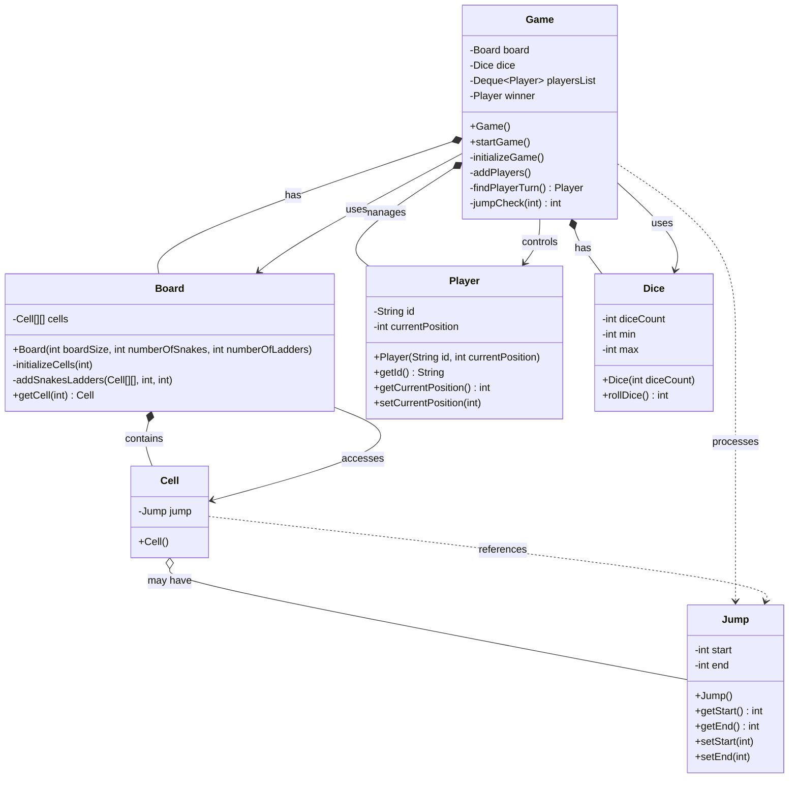

# Snake and Ladder System - UML Class Diagram

## Key Relationships Explained:

### 1. **Composition (has-a) Relationships:**
- `Game` has a `Board` - The game owns the board
- `Game` has a `Dice` - The game owns the dice
- `Game` has `Player` objects - The game manages the players
- `Board` has `Cell` objects - The board contains all cells

### 2. **Aggregation (may have) Relationships:**
- `Cell` may have a `Jump` - A cell can optionally have a snake or ladder

### 3. **Association (uses) Relationships:**
- `Game` uses `Player` - Game controls player turns and positions
- `Game` uses `Dice` - Game rolls dice for player moves
- `Game` uses `Board` - Game checks board state and jumps
- `Board` accesses `Cell` - Board retrieves cell information

### 4. **Dependency (processes) Relationships:**
- `Game` processes `Jump` - Game handles snake/ladder logic
- `Cell` references `Jump` - Cell may contain jump information

## System Architecture:

### **Game Flow:**
1. **Game** initializes with a **Board**, **Dice**, and **Player** objects
2. **Game** manages turn-based gameplay using a queue of players
3. **Dice** generates random numbers for player movement
4. **Board** contains a grid of **Cell** objects
5. **Cell** objects may contain **Jump** objects (snakes or ladders)
6. **Jump** objects define start and end positions for snakes/ladders

### **Key Components:**

1. **Game**: Main controller that orchestrates the entire game
2. **Board**: Represents the game board with cells arranged in a grid
3. **Cell**: Individual board positions that may contain snakes or ladders
4. **Jump**: Represents both snakes (start > end) and ladders (start < end)
5. **Player**: Represents a game participant with current position
6. **Dice**: Generates random numbers for player movement

### **Design Patterns Used:**

1. **Composition Pattern**: Game composes Board, Dice, and Players
2. **Grid Pattern**: Board uses 2D array of Cells
3. **Queue Pattern**: Players are managed in a Deque for turn-based gameplay
4. **Strategy-like Pattern**: Jump objects represent different movement strategies

### **Game Logic:**

- **Snakes**: Jump from higher position to lower position (start > end)
- **Ladders**: Jump from lower position to higher position (start < end)
- **Winning Condition**: Player reaches or exceeds the last cell position
- **Turn Management**: Players take turns in a round-robin fashion

This UML diagram shows a well-structured Snake and Ladder game with clear separation of concerns, where the Game class acts as the main controller coordinating all other components. 