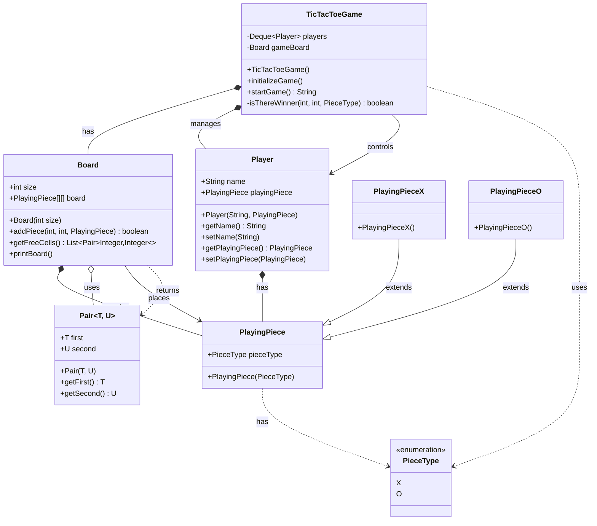

# Tic-Tac-Toe System - UML Class Diagram

## Key Relationships Explained:

### 1. **Inheritance (is-a) Relationships:**
- `PlayingPieceX` extends `PlayingPiece` - X piece is a type of playing piece
- `PlayingPieceO` extends `PlayingPiece` - O piece is a type of playing piece

### 2. **Composition (has-a) Relationships:**
- `TicTacToeGame` has `Board` - Game owns the board
- `TicTacToeGame` has `Player` objects - Game manages the players
- `Board` has `PlayingPiece` objects - Board contains the pieces
- `Player` has `PlayingPiece` - Player owns their playing piece

### 3. **Aggregation (uses) Relationships:**
- `Board` uses `Pair<Integer,Integer>` - Board uses pairs for coordinates

### 4. **Association (uses) Relationships:**
- `TicTacToeGame` controls `Player` - Game manages player turns
- `Board` places `PlayingPiece` - Board handles piece placement

### 5. **Dependency (uses) Relationships:**
- `TicTacToeGame` uses `PieceType` - Game checks piece types for winning
- `PlayingPiece` has `PieceType` - Piece knows its type
- `Board` returns `Pair<Integer,Integer>` - Board returns coordinate pairs

## System Architecture:

### **Core Components:**

1. **TicTacToeGame**: Main controller that orchestrates the entire game
2. **Board**: Represents the game board with a 2D array of playing pieces
3. **Player**: Represents a game participant with name and playing piece
4. **PlayingPiece**: Abstract base class for game pieces
5. **PlayingPieceX/PlayingPieceO**: Concrete implementations of playing pieces
6. **PieceType**: Enumeration defining the types of pieces (X, O)

### **Design Patterns Used:**

1. **Template Method Pattern**: TicTacToeGame provides game flow template
2. **Composition Pattern**: Game composes Board and Players
3. **Inheritance Pattern**: PlayingPieceX and PlayingPieceO extend PlayingPiece
4. **Queue Pattern**: Players are managed in a Deque for turn-based gameplay
5. **State Pattern**: Board tracks the state of each cell

### **System Flow:**

1. **Game Initialization**: TicTacToeGame creates players and board
2. **Turn Management**: Players take turns in a round-robin fashion
3. **Move Validation**: Board validates and places pieces
4. **Win Detection**: Game checks for winning conditions after each move
5. **Game Termination**: Game ends when there's a winner or tie

### **Game Logic:**

- **Board Representation**: 2D array of PlayingPiece objects
- **Turn Management**: Deque-based round-robin system
- **Move Validation**: Checks if cell is empty before placing piece
- **Win Detection**: Checks rows, columns, and diagonals
- **Tie Detection**: Game ends when no free cells remain

### **Key Features:**

- **Extensible Design**: Easy to add new piece types
- **Clean Separation**: Model classes separate from game logic
- **Turn-based Play**: Fair turn management system
- **Win Detection**: Comprehensive winning condition checking
- **Board Visualization**: Built-in board printing functionality

### **Architecture Benefits:**

1. **Modularity**: Clear separation between game logic and model
2. **Extensibility**: Easy to add new piece types or board sizes
3. **Maintainability**: Clean, well-structured code
4. **Reusability**: Components can be reused in other games
5. **Testability**: Each component can be tested independently

This UML diagram shows a well-structured Tic-Tac-Toe game with clear separation of concerns, proper use of inheritance patterns, and scalable architecture that can be easily extended for more complex board games. 